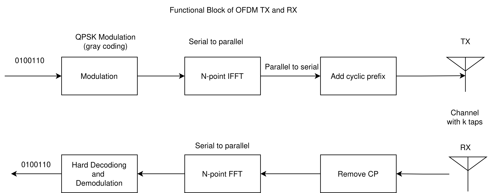

This is an implemntation of End to End setup of OFDM 
The function plot the symbol error rate over the various values of SNR 

The OFDM function block is as follows:
At Transmitter
1. Data symbol generation
2. Perform IFFT
3. Add CP
At channel:
1.Has N channel taps 
At Recevier:
1.Channel noise is added
2.Remove CP
3.Perform FFT
4. Hard Decoding and demodulation

Function: 
fft.cpp- genertes the output of complex fft operation when the N- no of subcariers is an multiple of 2 else DFT is performance
complexGaussian.cpp- generate the complex number with mean and Variance.
Plots.ipynb- Function plot SER  over varying SNR 
Ser_vs_noise.csv- stores the values of SER and SNR
